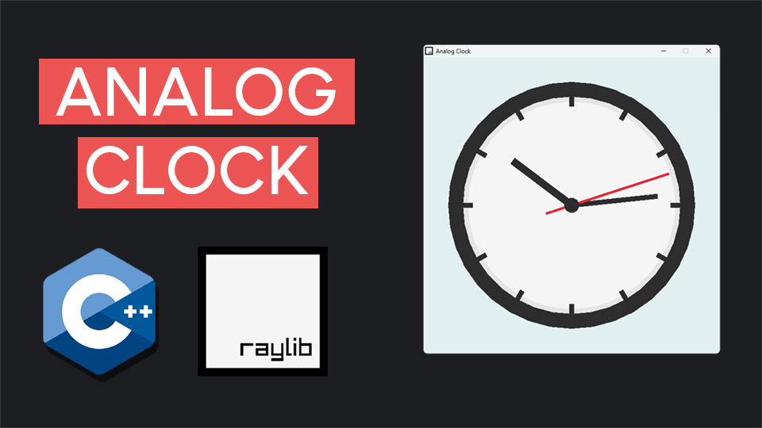

# Analog Clock with Raylib and C++

This repository contains the code for a video tutorial on creating a fully functional analog clock using Raylib and C++.

## Video Tutorial

<p align="center">
  
</p>

<p align="center">
🎥 <a href="https://youtu.be/YourVideoLinkHere">Watch the Video Tutorial on YouTube</a>
</p>

## Overview

In this tutorial, we build a visually appealing analog clock from scratch using C++ and Raylib. The tutorial guides you through every step of the process, from setting up the environment to designing the clock's components and implementing real-time updates.

## Features

- **Customizable Clock Face:** Learn how to design a polished clock face with an outer rim, hour markers, and inner details.
- **Real-Time Clock Hands:** Create dynamic hour, minute, and second hands that update based on the current time.
- **Object-Oriented Design:** The project is structured using OOP principles for clean and modular code.
- **Efficient Graphics Rendering:** Use Raylib’s simple and powerful API for smooth and efficient rendering.

## Code Structure

- **AnalogClock.hpp / AnalogClock.cpp:** Contains the `AnalogClock` class, which handles drawing the clock face, hands, and real-time updates.
- **main.cpp:** The main entry point that initializes the Raylib window, updates the clock, and renders it on the screen.

## How to Run

1. Clone this repository:
   ```bash
   git clone https://github.com/yourusername/analog-clock-raylib.git
   cd analog-clock-raylib
   ```

2. Install Raylib (if not already installed). Refer to the [Raylib installation guide](https://github.com/raysan5/raylib/wiki) for platform-specific instructions.

3. Compile the project:
   ```bash
   g++ main.cpp AnalogClock.cpp -o AnalogClock -lraylib -std=c++17
   ```

4. Run the compiled program:
   ```bash
   ./AnalogClock
   ```

## Project Steps

This project is divided into the following steps:
1. **Set Up Raylib** - Install Raylib and configure your development environment.
2. **Create the Window & Main Loop** - Initialize the Raylib window and set up the main game loop.
3. **Draw the Clock Face** - Design the clock's outer rim, inner rim, and clean clock face.
4. **Add Hour Markers** - Create and position 12 evenly spaced hour markers around the clock.
5. **Draw the Minute Hand** - Implement a dynamic minute hand that rotates in real time.
6. **Draw the Hour Hand** - Build the hour hand with proportional movement based on the minute value.
7. **Draw the Seconds Hand** - Add the seconds hand with an adjusted pivot point for smooth rotation.
8. **Fetch Real-Time Data** - Use C++’s `<ctime>` library to fetch the current time and update the clock dynamically.

## Dependencies

- C++17 or later
- Raylib

## Contributing

Contributions are welcome! If you have ideas for improvements, additional features, or bug fixes, feel free to open an issue or submit a pull request.

## License

This project is licensed under the MIT License. See the LICENSE file for details.

Enjoy coding your analog clock, and don’t forget to share your project! 🚀
